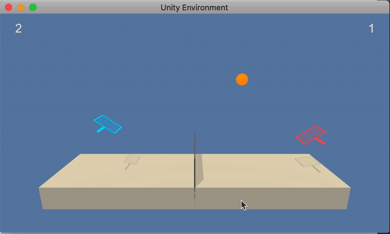

# Project : Collaboration and competition



## Description 
In this environment, two agents control rackets to bounce a ball over a net. If an agent hits the ball over the net, it receives a reward of +0.1. If an agent lets a ball hit the ground or hits the ball out of bounds, it receives a reward of -0.01. Thus, the goal of each agent is to keep the ball in play.

The task is episodic, and in order to solve the environment, the agents must get an average score of +0.5 (over 100 consecutive episodes, after taking the maximum over both agents). Specifically,

After each episode, we add up the rewards that each agent received (without discounting), to get a score for each agent. This yields 2 (potentially different) scores. We then take the maximum of these 2 scores.
This yields a single score for each episode.
The environment is considered solved, when the average (over 100 episodes) of those scores is at least +0.5.


## Files
- `evolution.py`: Main script used to train
- `test.py`: Script for testing
- `checkpoint_best.pth`: Saved model
- `RFReport3.pdf`: Technical report 

## Dependencies
To be able to run this code, you will need an environment with Python 3 and 
the dependencies are listed in the `requirements.txt` file so that you can install them
using the following command: 
```
pip install requirements.txt
``` 

Furthermore, you need to download the environment from one of the links below. You need only to select
the environment that matches your operating system:
- Linux : [link](https://s3-us-west-1.amazonaws.com/udacity-drlnd/P3/Tennis/Tennis_Linux.zip)
- MAC OSX : [link](https://s3-us-west-1.amazonaws.com/udacity-drlnd/P3/Tennis/Tennis.app.zip)
- Windows (32 - bit) : [link](https://s3-us-west-1.amazonaws.com/udacity-drlnd/P3/Tennis/Tennis_Windows_x86.zip)
- Windows (64 - bit) : [link](https://s3-us-west-1.amazonaws.com/udacity-drlnd/P3/Tennis/Tennis_Windows_x86_64.zip)

## Running
To run evolution strategies run:
python evolution.py 

To test saved model:
python test.py